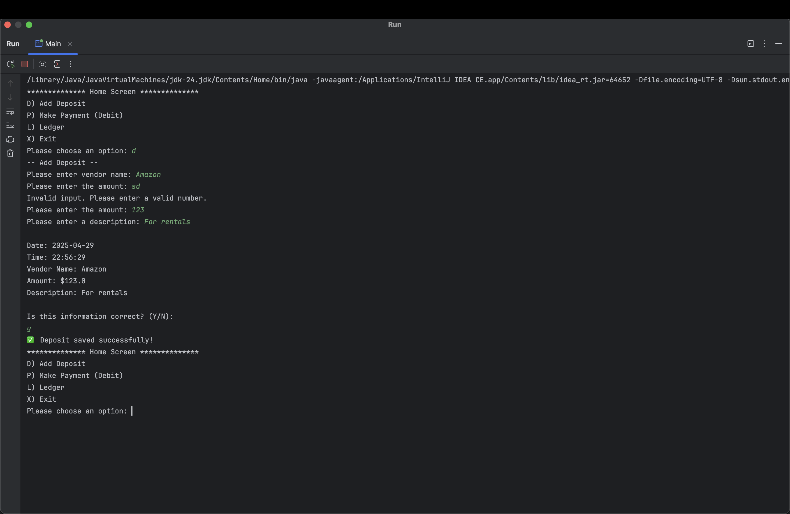
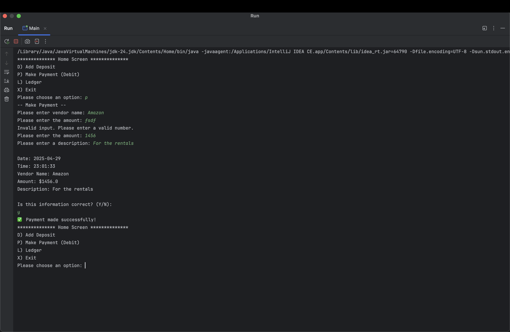
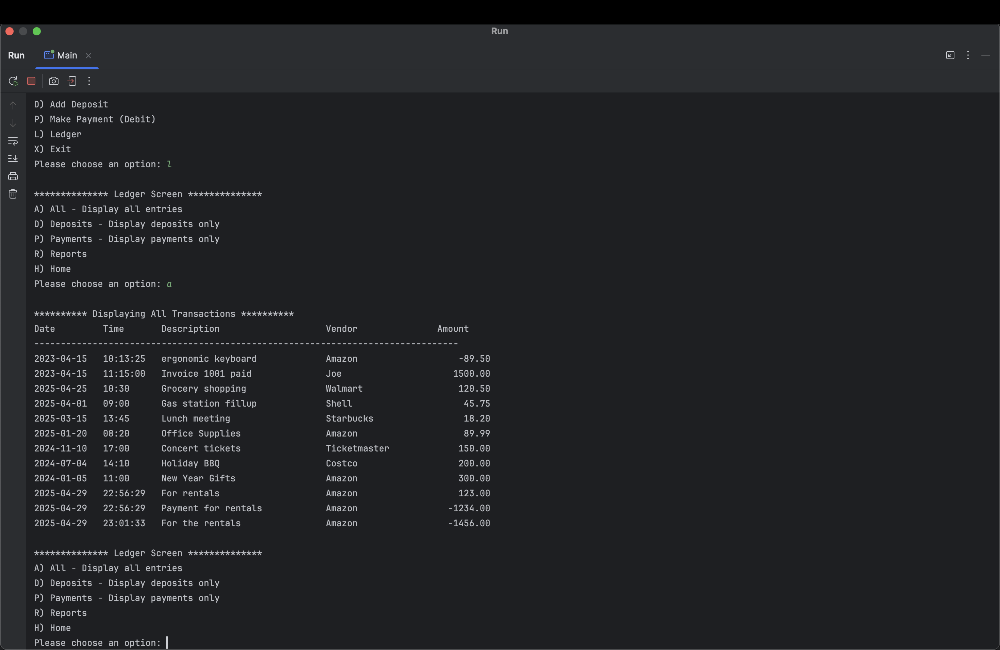
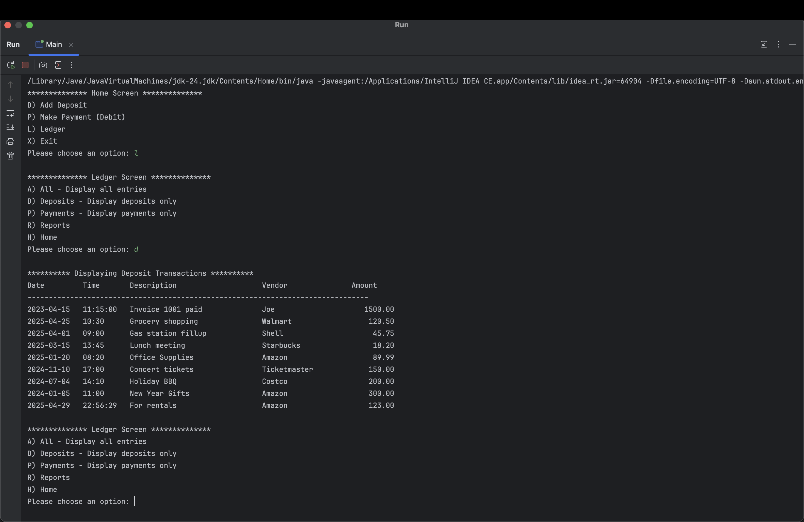
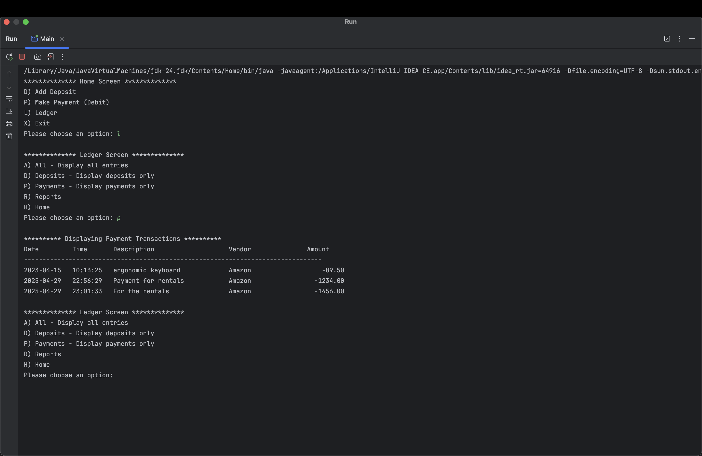
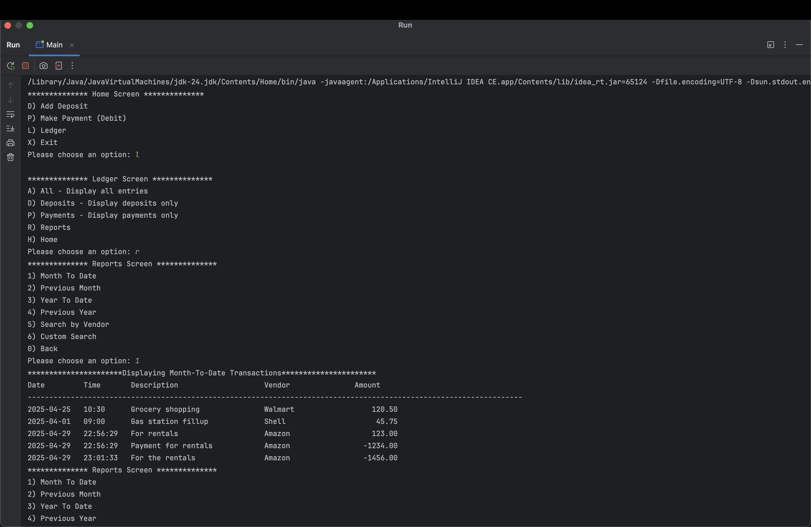
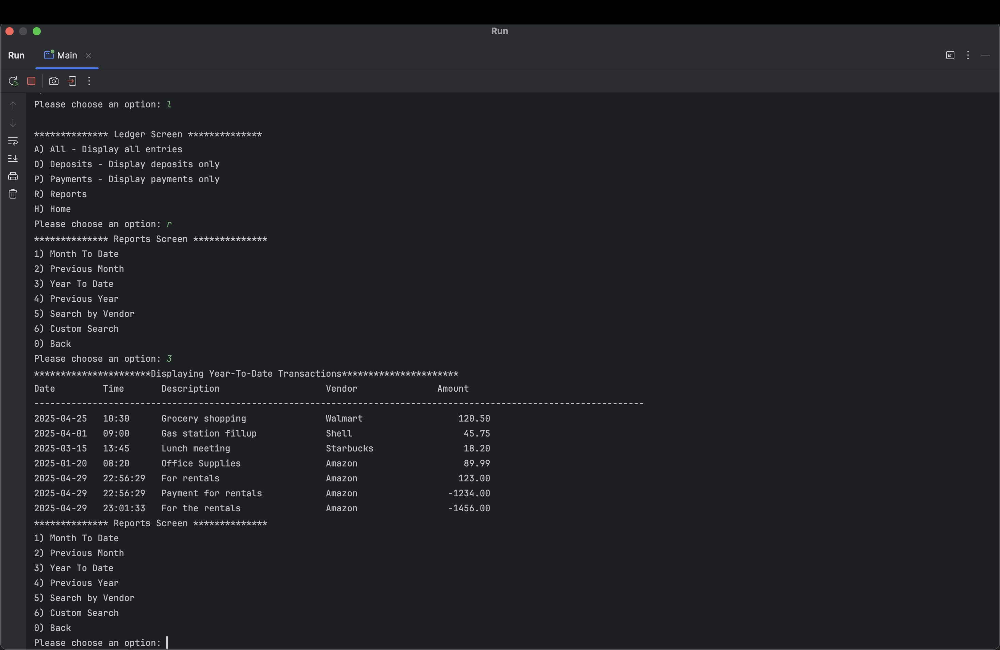
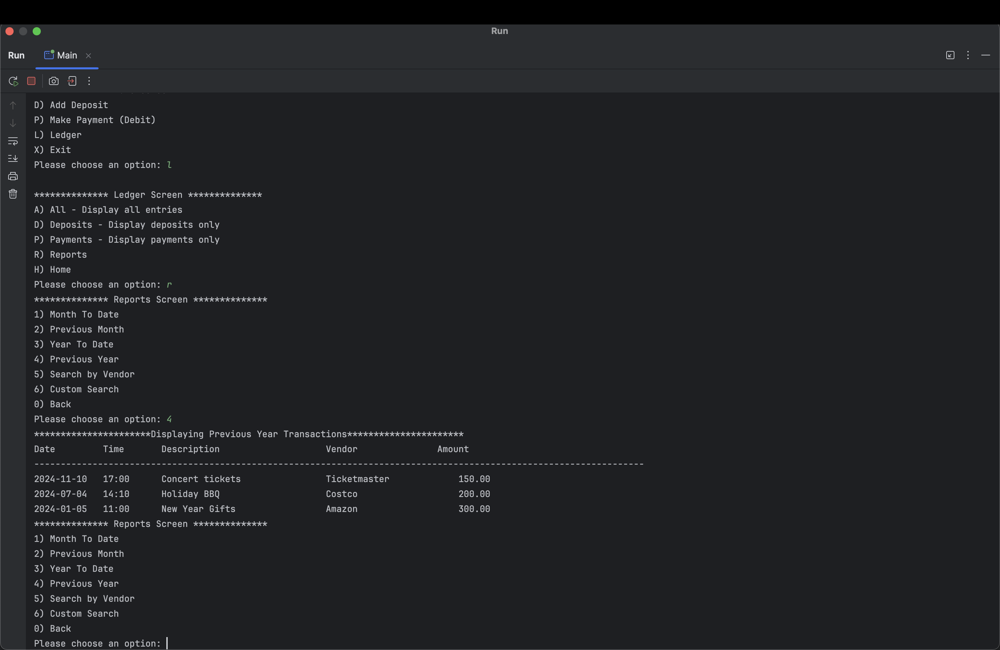
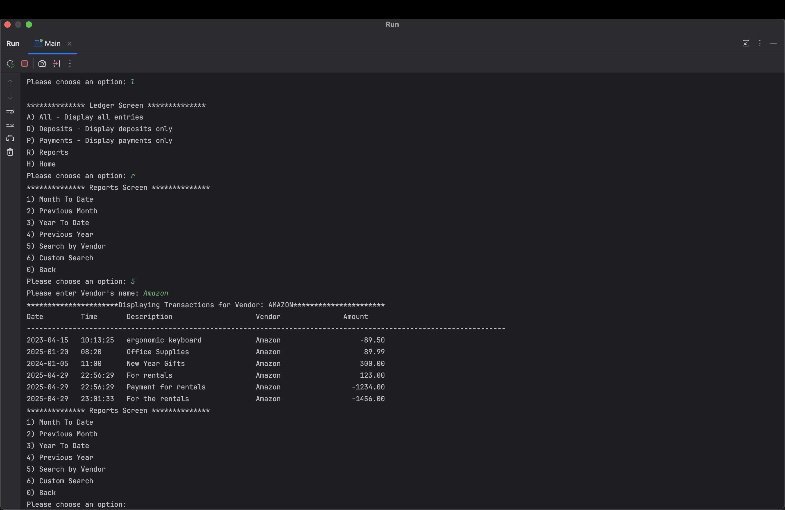

Project goal: 
  -The goal of this project is to create a Java CLI (Command Line Interface) application that helps users track financial transactions, deposits and payments, for business or personal use.
  
Main Steps:
- Create a main file and call the homescreen class inside it.
- Create a csv file to store all the transactions.
- Create 4 branch: Main, HomeScreen, AccountTransactions and Ledger

Project Features: 
  - Home Screen with main menu options:
     - Create a new file and make a class named HomeScreen
     - Inside the class, create a method called displayHomeScreen
     - Declare a Scanner object to handle user input and assist with file writing operations.
     - Inside the method, create a while loop that continuously displays the home screen options until the user chooses to exit (inputs "X").
     - Within the loop, use a switch statement to handle different menu choices:
         - D) Add Deposit:
             - In the AccountTransactions class, create a method called addDeposit.
             - Inside the method:
                - Use a scanner object to access the user inputs. 
                - Prompt the user to enter the deposit amount, description, and vendor name, and store these inputs in variables.
                - If not inserted a number/double, create a condition to avoid errors.
                - Display the user input and ask if it correct or not, if yes continue.
                - Use Java's date and time APIs to capture the current timestamp.
                - Use a Filewriter to write in the csv file.
                - Save the transaction details to a file as a properly formatted record.
                - Once all done, call it from the HomeScreen class when the user selects the "D" option (for Deposit) in the home screen menu.
                  
                  
                  
         - P) Make Payment (Debit):
             - In the AccountTransactions class, create a method called makePayment.
             - Inside the method:
                - Repeat same steps as Add deposit
                  
                  
                  
         - L) View Ledger
             - Create a new file inside the ledger folder called LedgerScreen.
             - Declare a Scanner object to handle user input.
             - Inside a ledgerScreen class, create displayLedgerOptions methods.
             - Inside the displayLedgerOptions, create a while loop that continuously displays the ledger screen options until the user chooses to exit (inputs "H").
             - Within the loop, use a switch statement to handle different menu choices:
                - A) All - Display all entries
               
                  
                  
                - D) Deposits - Display only the entries that are deposits into the account
                  
                  
                  
                - P) Payments - Display only the negative entries (or payments)
                  
                   
                  
                   - For those 3 conditions above I created:
                     - Created a class named TransactionFilters.
                       - Inside TransactionFilters created 3 methods called:
                         -  TransactionStore:
                            - This class holds a shared ArrayList called allTransactions.
                            - it lets other classes access the list of transactions.
                              
                         - getTransactionFromFile:
                            - Reads the transactions.csv file using a Scanner
                            - Use a while loop to read each line one by one and splits each line using .split("|") so we can separate the fields.
                            - Convert the amount from a string to a double using Double.parseDouble().
                            - Create a new TransactionsClass object using the values and adds it to the allTransactions Arraylist by calling the constructor you made.
                              
                         - displayAllTransactionsFilter:
                            - Receives a type (as a String) that decides what kind of transactions to display.( 3 types displayDepositOnly, displayPaymentsOnly, displayAllTransactions)
                            - alls getTransactionFromFile() to read and load all the transactions from the CSV file into the list.
                            - Create switch statement to print the header depending on the type
                            - Loops through each transaction in the list.
                            - Uses another switch to decide If this transaction should be printed (based on the filter type).Example: If type == displayDepositOnly only print if amount > 0
                            - Prints the transaction if it matches the filter.
                            - After all that, go to LedgerScreen and call the method and pass the type.
                              
                             

                - R) Reports - A new screen that allows the user to run pre-defined reports or to run a custom search
                     - 1) Month To Date: Month to Date" (MTD) means from the start of the current month up to today
                          
                          
              
                     - 2) Previous Month: Previous Month refers to the entire month before the current one
                          
                          
                          
                     - 3) Year To Date: Year to Date (YTD) refers to the period from the beginning of the current year up to the present date
                          
                          
                          
                     - 4) Previous Year: Previous Year refers to the year that occurred immediately before the current year
                          
                          
                          
                     - 5) Search by Vendor :prompt the user for the vendor nameand display all entries for that vendor
                          
                          
                          
                          - For those 5 conditions above I created:
                             - Created a method called filters inside the ReportFilters class.
                             - filters method accepts a filter type as an argument (e.g., "monthToDate", "previousMonth", "yearToDate", "previousYear", "searchByVendorName").
                             - Called the getTransactionFromFile from TransactionsFilters so that it can load the files.
                             - Define the required date ranges (e.g., start of the current month, first day of the previous month, etc.) using LocalDate for comparisons.
                             - Inside the filters method, use a switch statement to check the type of filter requested.
                             - Create a while lopp that will go over the transaction and filter based in the case.
                             - For each filter type (e.g., "monthToDate", "previousMonth", "yearToDate", etc.), check whether the transaction date falls within the desired range.
                             - For the "searchByVendorName" filter, prompt the user for a vendor's name, and filter the transactions based on whether the vendor name matches the input.
                               
                     - 6) Custom Search: prompt the user for the following search values.
                          - Create a custom serach class and inside delcare a method named customSearchOptionDisplay
                          - Ask user all the innput(start date, end date, vendor name, amout)
                          - Use scanner, get user and store it on varaibles
                          - Called the getTransactionFromFile from TransactionsFilters so that it can load the files.
                          - Create a foor loop that goes over the getTransactionFromFile and based on that filter it.
    
                         
                     - 0) Back - go back to the ledger page
                - H) Home - go back to the home page
              
         - X) Exit
            - Tell the program to stop running and close cleanly. 
           
  
