<h2>Project goal:</h1>

The goal of this project is to create a Java CLI (Command Line Interface) application that helps users track financial transactions, deposits, and payments, for business or personal use.

<h2>Main Steps:</h2>
<ul>
  <li>Create a main file and call the homescreen class inside it.</li>
  <li>Create a CSV file to store all the transactions.</li>
  <li>Create 4 branches: Main, HomeScreen, AccountTransactions, and Ledger.</li>
</ul>

<h2>Project Features:</h2>

Home Screen with main menu options:

<ul>
  <li>Create a new file and make a class named HomeScreen</li>
  <li>Inside the class, create a method called displayHomeScreen</li>
  <li>Declare a Scanner object to handle user input and assist with file writing operations.</li>
  <li>Inside the method, create a while loop that continuously displays the home screen options until the user chooses to exit (inputs "X").</li>
  <li>Within the loop, use a switch statement to handle different menu choices:</li>
</ul>

<h2>D) Add Deposit:</h3>

<ul>
  <li>In the AccountTransactions class, create a method called addDeposit.</li>
  <li>Inside the method:</li>
  <ul>
    <li>Use a scanner object to access the user inputs.</li>
    <li>Prompt the user to enter the deposit amount, description, and vendor name, and store these inputs in variables.</li>
    <li>If not inserted a number/double, create a condition to avoid errors.</li>
    <li>Display the user input and ask if it correct or not, if yes continue.</li>
    <li>Use Java's date and time APIs to capture the current timestamp.</li>
    <li>Use a FileWriter to write in the CSV file.</li>
    <li>Save the transaction details to a file as a properly formatted record.</li>
    <li>Once all done, call it from the HomeScreen class when the user selects the "D" option (for Deposit) in the home screen menu.</li>
  </ul>
</ul>

<h2>P) Make Payment (Debit):</h3>

<ul>
  <li>In the AccountTransactions class, create a method called makePayment.</li>
  <li>Inside the method:</li>
  <ul>
    <li>Repeat same steps as Add Deposit.</li>
  </ul>
</ul>

<h2>L) View Ledger</h3>
<ul>
  <li>Create a new file inside the ledger folder called LedgerScreen.</li>
  <li>Declare a Scanner object to handle user input.</li>
  <li>Inside a ledgerScreen class, create displayLedgerOptions methods.</li>
  <li>Inside the displayLedgerOptions, create a while loop that continuously displays the ledger screen options until the user chooses to exit (inputs "H").</li>
  <li>Within the loop, use a switch statement to handle different menu choices:</li>
</ul>
<ul>
  <li><h3>A) All - Display all entries</h3></li>
</ul>

<ul>
  <li><h3>D) Deposits - Display only the entries that are deposits into the account</h3></li>
</ul>

<ul>
  <li><h3>P) Payments - Display only the negative entries (or payments)</h2></li>
</ul>

For those 3 conditions above I created:

<ul>
  <li>Created a class named TransactionFilters.</li>
  <li>Inside TransactionFilters created 3 methods called:</li>
  <ul>
    <li>TransactionStore:
      <ul>
        <li>This class holds a shared ArrayList called allTransactions.</li>
        <li>It lets other classes access the list of transactions.</li>
      </ul>
    </li>
    <li>getTransactionFromFile:
      <ul>
        <li>Reads the transactions.csv file using a Scanner</li>
        <li>Use a while loop to read each line one by one and splits each line using .split("|") so we can separate the fields.</li>
        <li>Convert the amount from a string to a double using Double.parseDouble().</li>
        <li>Create a new TransactionsClass object using the values and adds it to the allTransactions ArrayList by calling the constructor you made.</li>
      </ul>
    </li>
    <li>displayAllTransactionsFilter:
      <ul>
        <li>Receives a type (as a String) that decides what kind of transactions to display. (3 types displayDepositOnly, displayPaymentsOnly, displayAllTransactions)</li>
        <li>alls getTransactionFromFile() to read and load all the transactions from the CSV file into the list.</li>
        <li>Create switch statement to print the header depending on the type.</li>
        <li>Loops through each transaction in the list.</li>
        <li>Uses another switch to decide If this transaction should be printed (based on the filter type). Example: If type == displayDepositOnly only print if amount > 0.</li>
        <li>Prints the transaction if it matches the filter.</li>
        <li>After all that, go to LedgerScreen and call the method and pass the type.</li>
      </ul>
    </li>
  </ul>
</ul>

<ul>
  <li><h3>R) Reports - A new screen that allows the user to run pre-defined reports or to run a custom search</h2></li>
  <ul>
    <li><h3>1) Month To Date: Month to Date" (MTD) means from the start of the current month up to today</h3></li>
      
     
      
      
     <li><h3>2) Previous Month: Previous Month refers to the entire month before the current one</h3></li>
      
     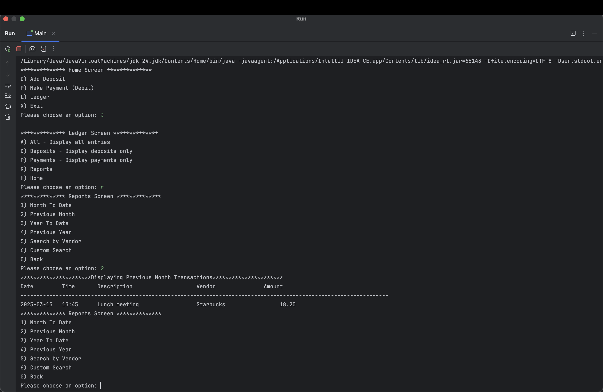
      
      
     <li><h3>3) Year To Date: Year to Date (YTD) refers to the period from the beginning of the current year up to the present date</h3></li>
      
     
      
      
     <li><h3>4) Previous Year: Previous Year refers to the year that occurred immediately before the current year</h3></li>
     
      
      
     <li><h3>5) Search by Vendor: Prompt the user for the vendor name and display all entries for that vendor</h3></li>
     
    
  
   
  </ul>
  
For those 5 conditions above I created:

  <ul>
    <li>Created a method called filters inside the ReportFilters class.</li>
    <li>filters method accepts a filter type as an argument (e.g., "monthToDate", "previousMonth", "yearToDate", "previousYear", "searchByVendorName").</li>
    <li>Called the getTransactionFromFile from TransactionsFilters so that it can load the files.</li>
    <li>Define the required date ranges (e.g., start of the current month, first day of the previous month, etc.) using LocalDate for comparisons.</li>
    <li>Inside the filters method, use a switch statement to check the type of filter requested.</li>
    <li>Create a while loop that will go over the transaction and filter based in the case.</li>
    <li>For each filter type (e.g., "monthToDate", "previousMonth", "yearToDate", etc.), check whether the transaction date falls within the desired range.</li>
    <li>For the "searchByVendorName" filter, prompt the user for a vendor's name, and filter the transactions based on whether the vendor name matches the input.</li>
  </ul>
   
   
  <li><h3>6) Custom Search: Prompt the user for the following search values.</h3></li>
  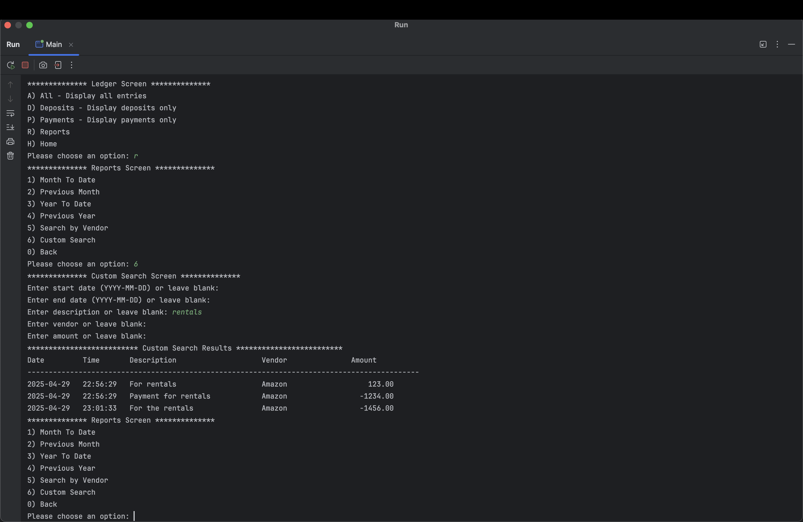
   
   
  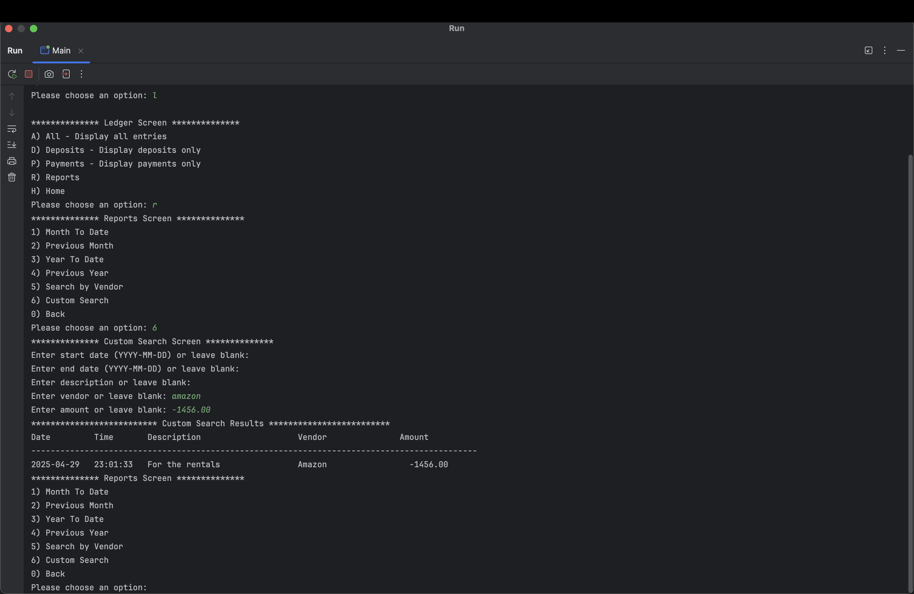
    
   
  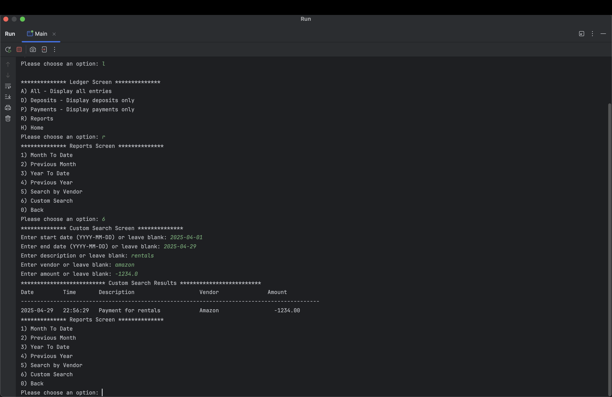
    
   
  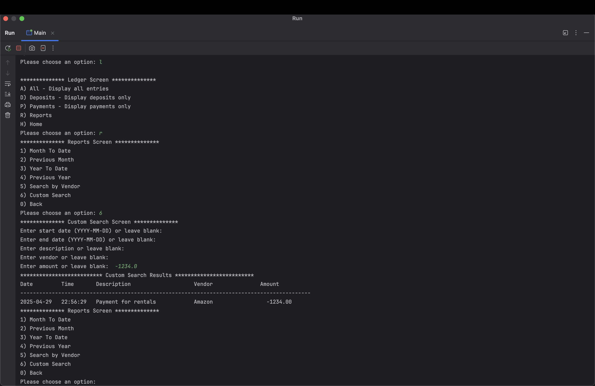
    
   
  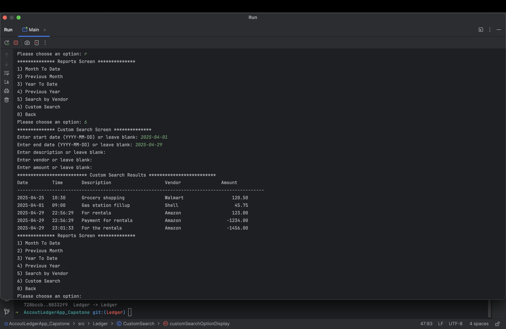
    
   
  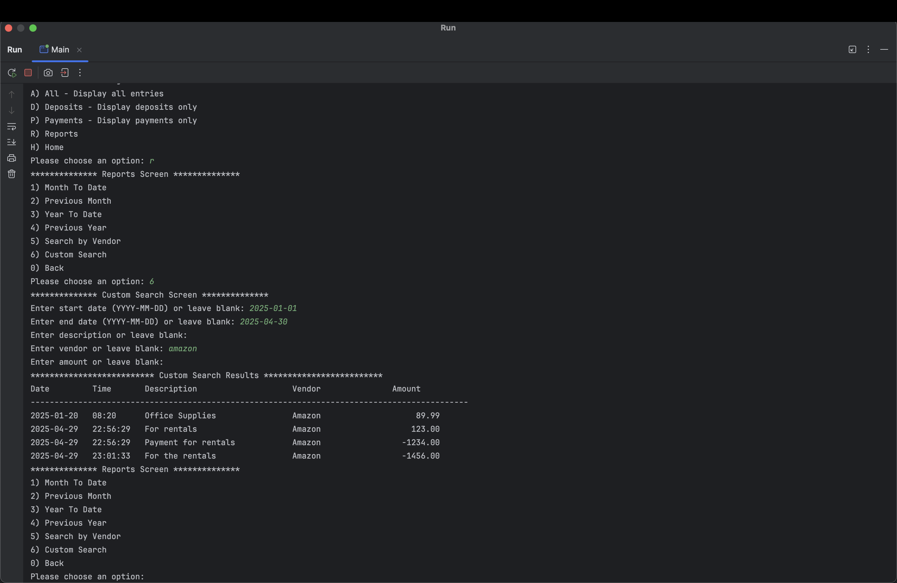

  
Create a custom search class and inside declare a method named customSearchOptionDisplay.

  <ul>
    <li>Ask user all the input (start date, end date, vendor name, amount).</li>
    <li>Use scanner, get user and store it in variables.</li>
    <li>Called the getTransactionFromFile from TransactionsFilters so that it can load the files.</li>
    <li>Create a for loop that goes over the getTransactionFromFile and based on that filter it.</li>
  </ul>
 

  <ul>
    <li><h3>0) Back - go back to the ledger page</h3></li>
  </ul>
  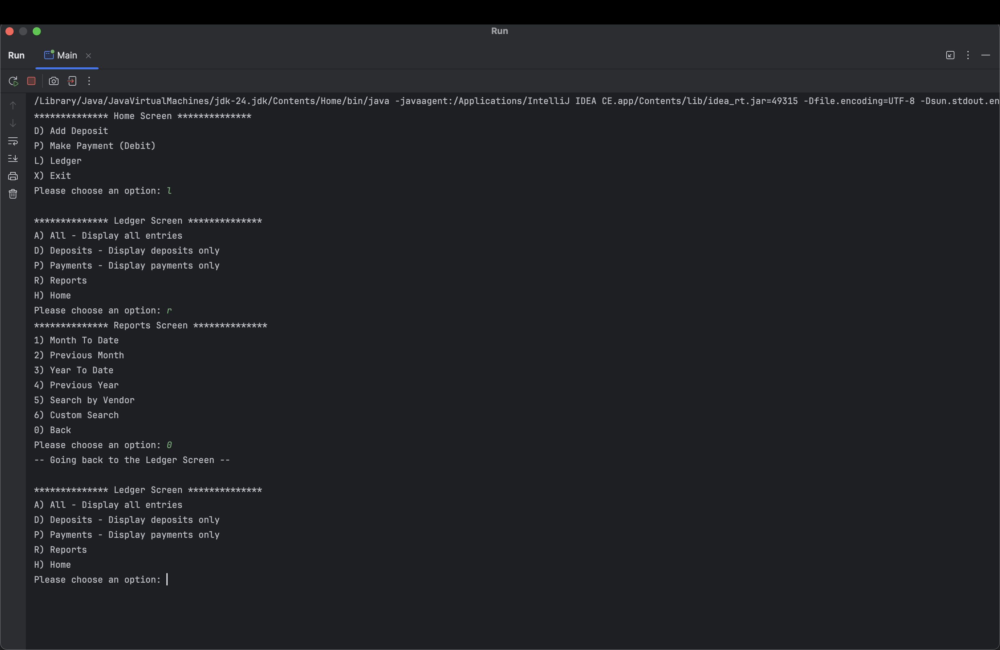
  

  <ul>
    <li><h3>H) Home - go back to the home page</h2></li>
  </ul>
  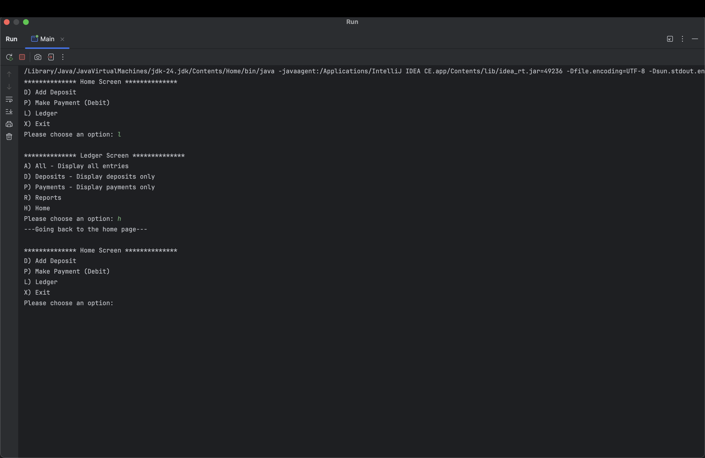

  <h2>X) Exit - Tell the program to stop running and close cleanly</h3>
  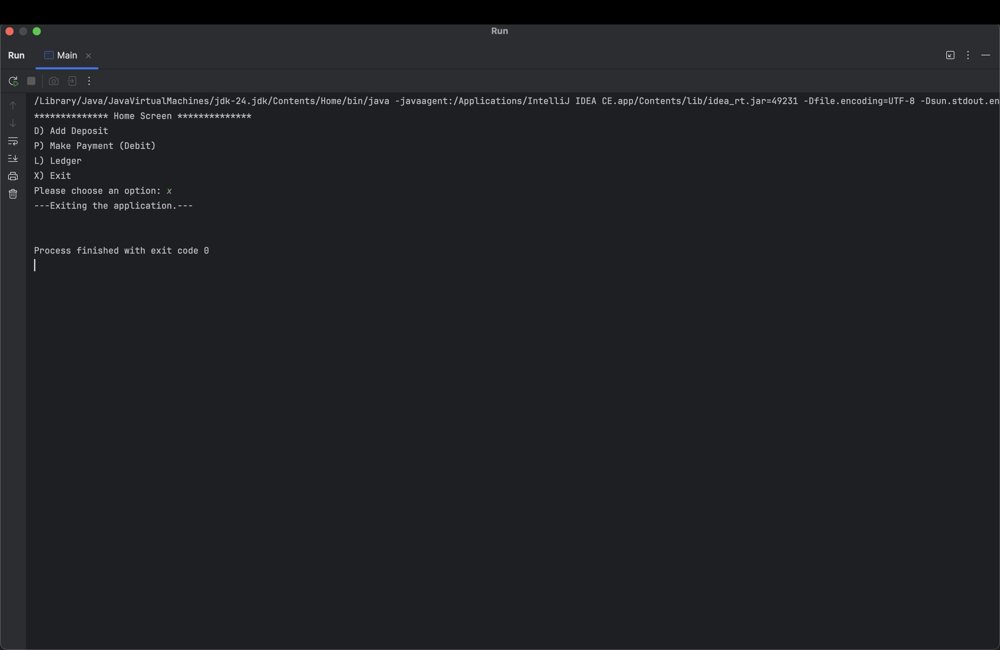
</ul>

<h1>Interesting piece of my code</h1>
 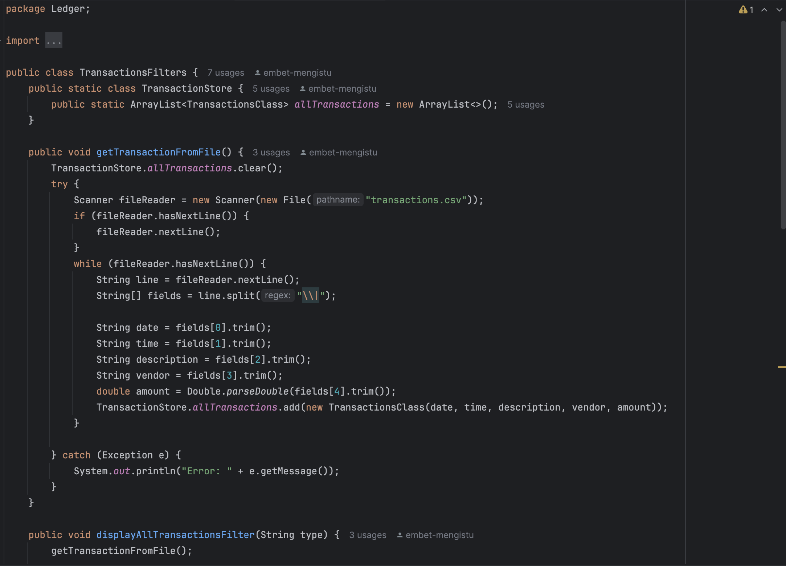
  
  
  
   
  
   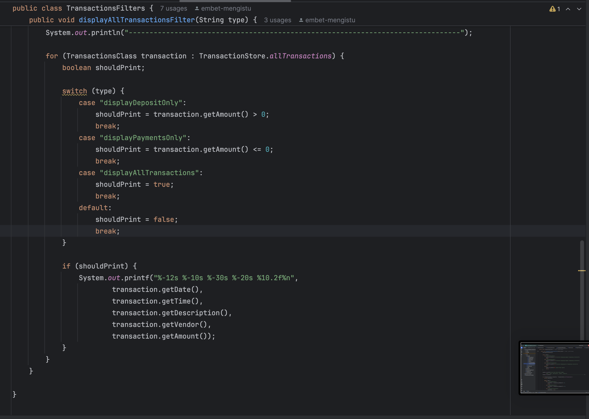
    
  
 
<strong>What makes this code interesting is:</strong>

   
<ul>
   <li><strong>ArrayList in a Class:</strong> You can declare an ArrayList inside a class as static to make it globally available. This prevents the need to repeatedly declare it elsewhere, providing easy access throughout the program.</li>
    

   <li><strong>Loading the File Once:</strong> The <code>getTransactionFromFile()</code> method loads the file once and stores the data in an ArrayList. This way, you can easily call the transactions from anywhere in the program without reloading the file, avoiding duplicate code and improving efficiency.</li>
    

   <li><strong>Using <code>displayAllTransactionsFilter</code> with Switch Statements:</strong> The <code>displayAllTransactionsFilter</code> method takes an argument that determines which type of transactions to display. It uses a switch statement to assign a condition to a boolean variable (<code>shouldPrint</code>), which is then used to filter the transactions. This design simplifies the process of displaying different types of transactions based on user input.</li>
</ul>

